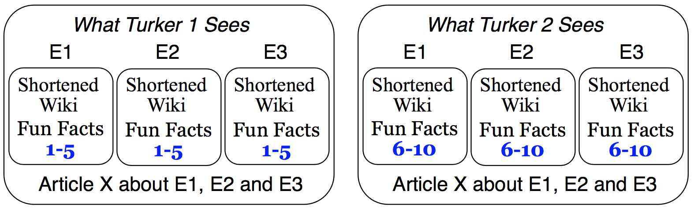
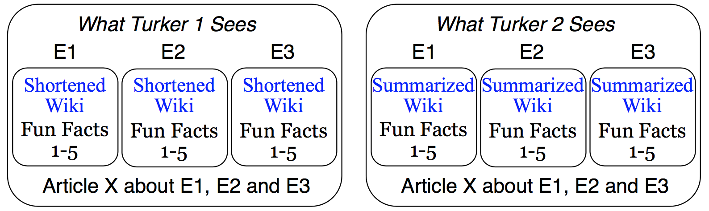
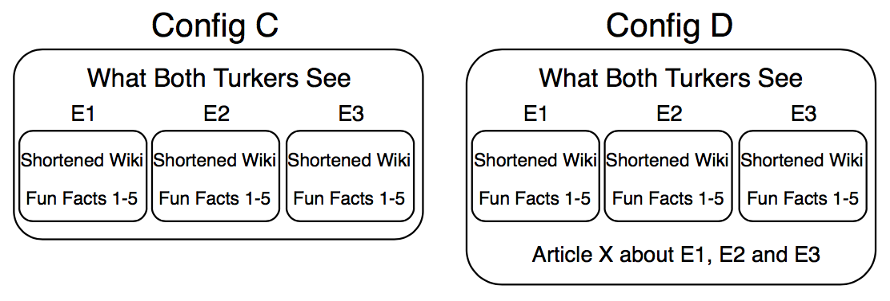

# Topical-Chat
We introduce Topical-Chat, a knowledge-grounded human-human conversation dataset where the underlying knowledge spans 8 broad topics and conversation partners don’t have explicitly defined roles.

Topical-Chat broadly consists of two types of files:

(1) Conversation Files - these are .json files that contain a conversation between two workers on Amazon Mechanical Turk (also known as Turkers)

(2) Reading Set Files - these are .json files that contain knowledge sections from different data sources (Wikipedia, Reddit, and Washington Post) that are served up to a particular Turker to read and refer to as they are having a conversation.

In order to get access to the reading set, we provide a simple 1 script solution (build.py) to pull the text from the necessary datasources to construct the full reading set.

For more detailed information about the dataset and benchmarking experiments refer to
[Paper](https://m.media-amazon.com/images/G/01/amazon.jobs/3079_Paper._CB1565131710_.pdf)

## Setup Environment to Build Data
```
Ensure that your Python Interpreter >= 3.7
git clone https://github.com/alexa/alexa-prize-topical-chat-dataset.git
cd alexa-prize-topical-chat-dataset/src
pip3 install -r requirements.txt

Building the data requires Reddit credentials. 
Please create your own Reddit API keys: https://www.reddit.com
```
## Build Data
```
python3 build.py  --reddit_client_id CLIENT_ID --reddit_client_secret CLIENT_SECRET --reddit_user_agent USER_AGENT
```
build.py will take around 50 minutes to finish.  
build.py will read each file in /alexa-prize-topical-chat-dataset/reading_sets/pre-build folder, create a replica JSON with the exact same name with the actual reading sets included in /alexa-prize-topical-chat-dataset/reading_sets/post-build folder.

## Data

### Data Statistics:
|                   | Train | Valid Freq. | Valid Rare | Test Freq. | Test Rare | All |
| ----              | ----  |    ----     |    ----    |   ----     |   ----    |  ----   |
|# conversations    | 8628  |    539      |    539     |   539      |   539     |  10784  |
|# utterances       | 188378 |   11681    |    11692   |   11760    |   11770   |  235434 |
|average # turns per conversation  | 21.8 |    21.6    |   21.7     |   21.8    |   21.8  |  21.8   |
|average length of utterance    | 19.5  |    19.8      |    19.8     |   19.5      |   19.5     |  19.6   |

### Data Split:
The data is split into 5 distinct groups: Train, Valid Frequent, Valid Rare, Test Frequent and Test Rare.
Frequent set contains entities frequently seen in the training set
Rare set contains entities that were infrequently seen in the training set

### Configuration Type:
For each conversation, we apply a random configuration from a pre-defined list of configurations. Configurations are defined to impose varying degrees of information symmetry or asymmetry between partners, leading to the collection of a wide variety of conversations.








### Conversation File:

**Each .json file in alexa-prize-topical-chat-dataset/conversations/ directory has the specified format:**
```
{
<conversation_id>: {
	“article_url”: <article url>,
	“config”: <config>, # one of A,B,C, D
	“content”: [ # ordered list of conversation turns
		{ 
		“agent”: “agent_1”, # or “agent_2”,
		“message” : <message text>,
		“sentiment”: <text>,
		“knowledge_source” : [“AS1”, “Personal Knowledge”,...],
		“turn_rating”: “Poor”, # Note: changed from number to actual annotated text
		},…
	],
	“conversation_rating”: {
		“agent_1”: “Good”,
		“agent_2”: “Excellent”
		}
},…
}
```
- conversation_id: a unique hash id that refers to a conversation within the corpus
- article_url: a url link that refers to the Washington Post article that was served to the two turkers
- config: The configuration type that is applied to the Reading Set
- content: An ordered list of conversation turns
	- agent: an id that refers to which Turker generated which turn
	- message: response from Turker
	- sentiment: self-annotation on the sentiment of the Turker's message
	- knowledge source: self-annotation where the Turker refers to which section of the Reading Set gave rise to their response
	- turn_rating: partner-annotation where the Turker's partner rates the quality of the message
- converation_rating: self-annotation where the Turker rates the quality of the conversation
	- agent_1: rating of the conversation from Turker 1
	- agent_2: rating of the conversation from Turker 2

### Reading Sets File:

**Each .json file in alexa-prize-topical-chat-dataset/reading_sets/ directory:**
```
{
<conversation_id> : {
	“config” : <config>,
    “agent_1”: {
	    “FS1”: {
		 “entity”: <entity name>,
		 “shortened_wiki_lead_section”: <section text>,
		 “fun_facts”: [ <fact1_text>, <fact2_text>,…]
		    },
	    “FS2”:…
                    },
        ....
        },
    “agent_2”: {
	    “FS1”: {
		 “entity”: <entity name>,
		 “shortened_wiki_lead_section”: <section text>,
		 “fun_facts”: [ <fact1_text>, <fact2_text>,…],
	            },
	    “FS2”:…
                    },
        ...
        },
    “article”: {
		“url”: <url>,
		“headline” : <headline text>,
		“AS1”: <section 1 text>,
		“AS2”: <section 2 text>,
		“AS3”: <section 3 text>,
		“AS4”: <section 4 text>
	    }
	}
…
}
```
- conversation_id: a unique hash id that refers to a conversation within the corpus
- config: The configuration type that is applied to the Reading Set
- article_url: a url references the WaPo article
- agent_1: contains the reading set shown to this particular agent in the referenced conversation
	- FS*: Factual Section that will contain knowledge bits. Each number coming after FS referneces an entity
		- entity: referencing real-world object, all knowledge bits in the corresponding factual section will reference this entity
		- shortened_wiki_lead_section: Consists of the first paragraph of the lead section from wikipedia referencing the entity and optionally the second paragraph if the first paragraph contains less than 50 words.
		- summarized_wiki_lead_section: A summarized version created by extractively summarizing the entire lead section using TextRank into 150 words or less.
		- fun_facts: crowdsourced fun facts for each entity from sub-reddit todayilearned.
	- AS*: Article Section. A WaPo article is split into sections. Each number coming after AS references an article section.
- headline: headline of WaPo article. Article is shared to both agents.

## Wikipedia Data
**.json file found in src/wiki.json**

build.py will put data from wiki.json into corresponding reading sets.

```
{
  "shortened_wiki_lead_section": {
    <shortened wiki lead section text>: <unique_identifier>,
    <shortened wiki lead section text>: <unique_identifier>
  },
  "summarized_wiki_lead_section": {
    <summarized wiki lead section text>": <unique_identifier>,
    <summarized wiki lead section text>": <unique_identifier>
  }
}
```

## Citation
If you use the dataset in your work please cite with the following
```
@inproceedings{Gopalakrishnan2019,
  author={Karthik Gopalakrishnan and Behnam Hedayatnia and Qinlang Chen and Anna Gottardi and Sanjeev Kwatra and Anu Venkatesh and Raefer Gabriel and Dilek Hakkani-Tür},
  title={{Topical-Chat: Towards Knowledge-Grounded Open-Domain Conversations}},
  year=2019,
  booktitle={Proc. Interspeech 2019},
  pages={1891--1895},
  doi={10.21437/Interspeech.2019-3079},
  url={http://dx.doi.org/10.21437/Interspeech.2019-3079}
}

```
```
Gopalakrishnan, Karthik, et al. "Topical-Chat: Towards Knowledge-Grounded Open-Domain Conversations."
```
## Acknowledgements
We would like to thank Anju Khatri, Anjali Chadha and Mohammad Shami for their help on the public release of the dataset. We also acknowledge Jeff Nunn and Yi Pan for their early contributions to this effort.
