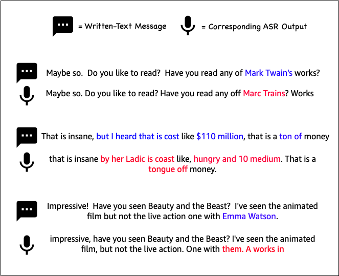

# Topical-Chat ASR: An ASR-augmented version of Topical-Chat

This README describes Topical-Chat ASR, an augmentation of Topical-Chat with non-trivial synthetic and actual ASR hypotheses.



## Synthetic: `/TopicalChatASR/synthetic`
For each file in the original Topical-Chat dataset, non-trivial synthetic ASR hypotheses are constructed at four different corpus-level **target** Word Error Rates (WER). We used the ASR error simulator method based on n-gram confusion matrix and trained the simulator on transcribed ASR output from an internal user study. For a detailed description of the adopted simulation method, see: [Investigation of Error Simulation Techniques for Learning Dialog Policies for Conversational Error Recovery](https://arxiv.org/abs/1911.03378).

The target WERs chosen for simulation were 0.1, 0.15, 0.2 and 0.3. For each target WER, the errors were simulated with a single random seed for train and five random seeds for validation and test splits. Thus, **for each target WER**, there are:
1. 1 file for training
2. 5 files for `valid_freq`, 5 files for `valid_rare`
3. 5 files for `test_freq`, 5 files for `test_rare`

For each turn in each dialog, the `"message"` key contains the written-text message from the original Topical-Chat dataset, and the `"message_sim_asr"` key contains the corresponding error-simulated message.

### NOTES
- The error simulator was not specifically optimized/trained to simulate errors for open-domain dialog.
- The no-punctuation synthetic setting (NO-PUNC) from the paper is easy to enable using a regular expression (sample [here](https://github.com/facebookresearch/ParlAI/blob/1a10dd650662a787788d691eb4e0b7ed6233f88d/parlai/core/metrics.py#L59)), so no data is provided for this setting.


## Actual: `/TopicalChatASR/actual`
For a small subset of the original Topical-Chat test sets, actual ASR errors were introduced. These errors are particularly important and helpful in studying multiple types of problems in open-domain dialog: entity recognition and linking, neural response generation, next utterance classification, etc. We hope these smaller, speech-based analogues of the original Topical-Chat test sets, titled `test_freq_audio` and `test_rare_audio`, serve as future benchmarks for speech-robustness of open-domain dialog models.

From each of the original test sets, 40 uniquely representative dialogs were picked and English-speaking human subjects of various ethnicities were asked to verbally read the dialogs with their own audio setup and record their audio, resulting in phonetically rich test sets.

Two automated transcription systems (A and B) were independently used to transcribe the collected audio, and each dialog transcription was aligned with the text of the original dialog based on edit distance followed by manual re-alignment to obtain the turn-level transcriptions. The transcriptions by systems A and B are in the `"message_asr_A"` and `"message_asr_B"` keys respectively.

### NOTES
- Neither systems A nor B were specifically optimized for the use-case of transcribing open-domain dialog. Nor were they optimized to transcribe a verbal reading of written-text dialogs.

- The WERs computed are higher than true ASR WERs because:

  - the ASR transcripts are not being compared against actual human transcriptions of the audio, rather, they are being compared against the original written-text messages that were supposed to be verbally read.

  - normalization of the ASR outputs against the original written-text was not performed, for example: `that's` vs. `that is`, `superpower` vs. `super power`, `222-0` vs. `222 to 0`.


## Citation
If you use this dataset, please cite the following two papers:
### Topical-Chat ASR
```
@inproceedings{gopalakrishnan2020speechrobust,
  author={Gopalakrishnan, Karthik and Hedayatnia, Behnam and Wang, Longshaokan and Liu, Yang and Hakkani-Tür, Dilek},
  title={{Are Neural Open-Domain Dialog Systems Robust to Speech Recognition Errors in the Dialog History? An Empirical Study}},
  year={2020},
  booktitle={INTERSPEECH}
}

```
### Topical-Chat
```
@inproceedings{gopalakrishnan2019topical,
  author={Gopalakrishnan, Karthik and Hedayatnia, Behnam and Chen, Qinlang and Gottardi, Anna and Kwatra, Sanjeev and Venkatesh, Anu and Gabriel, Raefer and Hakkani-Tür, Dilek},
  title={{Topical-Chat: Towards Knowledge-Grounded Open-Domain Conversations}},
  year={2019},
  booktitle={INTERSPEECH}
}

```
